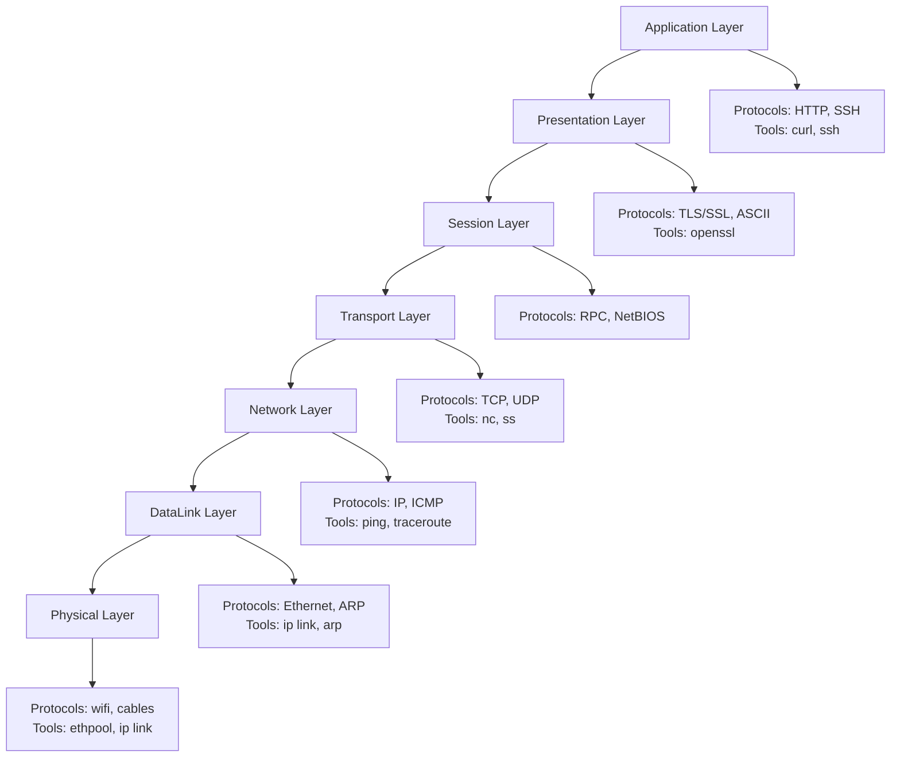
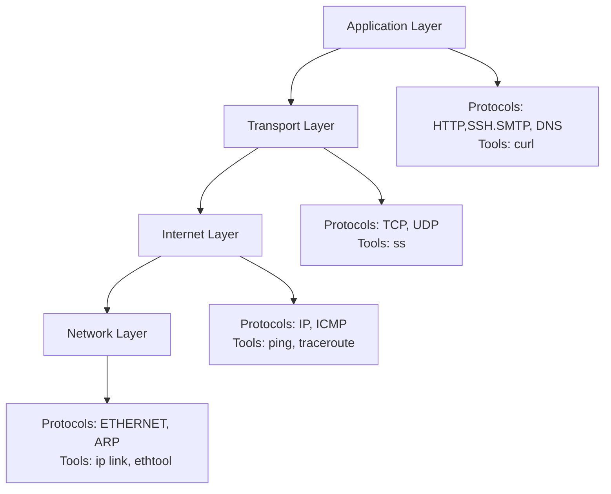

# Daily DevOps + SRE Challenge Series – Season 2  
## Day 15: OSI & TCP/IP Model Foundations for DevOps/SRE

### Solution

Day 15 of DevOps/SRE Challenge Season 2
---

To solve the below scenarios, I have used mermaid to draw the diagrams.You can use any tool whichever you are comfortable in.

###  Hands-On Challenge 

#### Scenario A: Draw diagram of OSI and TCP/IP models and Map Layer. Add Protcols and Tools also.

- Here I have Draw both models (OSI and TCP/IP using mermaid). 
  Also, I have listed the protocols and tools used in each of the layer.

## OSL Model

---

## TCP/IP Model

---

#### Scenario B: Protocol Mapping Exercise

Given these tools/protocols, map each to its layer(s):  
- ping  
- ssh  
- dig  
- curl  
- nc  
- ip addr  
- arp  
- openssl  
- traceroute  
- tcpdump  

Fill out a table like:
| Tool/Protocol | OSI Layer(s) | TCP/IP Layer | Description |
|---------------|--------------|--------------|-------------|
| ping          | 3, 1         | Internet     | Tests IP reachability using ICMP |
| ssh           | 7, 4         | Application, Transport | Secure shell (needs network and transport) |
| ...           | ...          | ...          | ...         |

#### Scenario C: Mini Incident Simulation

A developer says:  
> “I can’t reach the app at http://10.10.10.20:5000 from my laptop. Ping fails, but DNS resolves.”

Your task:
1. Identify which layer(s) might be failing based on symptoms
2. List which commands/tools you would use in order to troubleshoot—from bottom to top

Document your answer in solution.md.

---

### 4) What to Watch For (Common Gotchas)
- Not every protocol is at only one layer (e.g., DNS = Application, but depends on Transport/Network)
- Some tools work at multiple layers (e.g., tcpdump sees almost everything!)
- Real-world cloud infra may “hide” some layers (e.g., you don’t see cables, but you still check link status in VMs)
- The PDU (data format) matters for troubleshooting (e.g., "packet loss" is different from "frame error")

---
