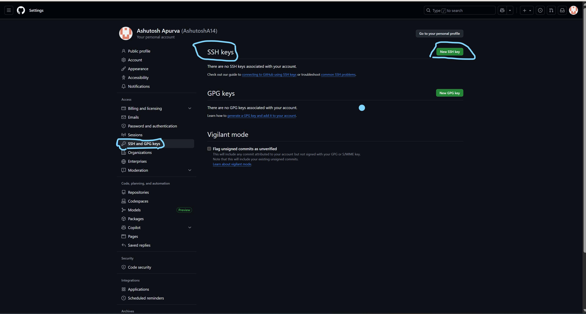
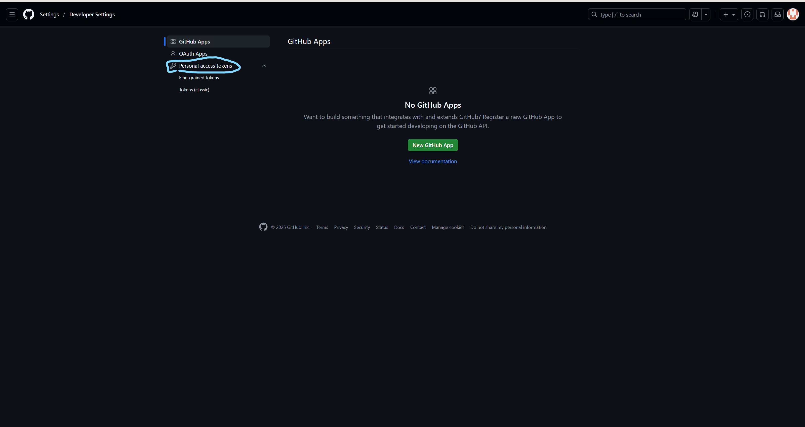

## Step by step guide for DevOps and SRE beginners to setup GitHub account.

1. Set Up the Environment

  - Installing Git in Linux

    *Linux*  

    **Install Git using the package manager:**

     ``sudo apt install git``    # Debian-based systems  
     ``sudo yum install git``  # RHEL-based systems

    
- Verify installation:
    
    ``git --version``

2. Setting Up GitHub Account

    **GitHub**

 - Go to [GitHub](https://github.com/) and sign up.

   
   
 - Confirm your email address.

 - Create two GitHub accounts to simulate code reviews and merging changes.

 - Set up SSH authentication or a Personal Access Token (PAT) for secure access.

     
     

2. Clone and Configure Git

  - Fork the Repository: Fork the provided GitHub and GitLab repositories to your own account.
  - Clone the Repository: Clone the forked repository to your local machine.

    `git clone https://github.com/AshuApurva14/DevOps-SRE-Challenge-Series.git`

  - Configure Git: Set up your username and email.
   
    `git config --global user.name "Ashu Apurva"`

    `git config --global user.email "ashuapurva@example.com"`

3. Create a Feature Branch and Make Changes

  - Create a new branch for your feature.

     `git checkout -b feature/your-feature-name`

  - Make changes and check the differences before staging:

    

     `git diff`

  - Stage and commit your changes:

   
     `git add .`

     `git commit -m "Added new feature: your-feature-name"`

  - Modify the last commit if needed:

     `git commit --amend -m "Updated commit message with additional changes"`

4. Push Your Changes and Create a Pull Request (PR)

  - Verify the current branch (HEAD position):

     `git rev-parse --abbrev-ref HEAD`

  - Push your branch to the remote repository:

     `git push origin feature/your-feature-name`

  - Create a Pull Request (PR) on GitHub and a Merge Request (MR) on GitLab.

    *Follow best practices for writing PR descriptions and handling reviews.*

5. Resolve Merge Conflicts

  - Check the current remote repository (origin):

    `git remote -v`

  - Simulate a merge conflict by modifying the same file from another GitHub account.

  - Pull the latest changes and merge.

    `git checkout main`

    `git pull origin main`

    `git checkout feature/your-feature-name`

    `git merge main`

  - Resolve conflicts manually and commit.

    `git add .`

    `git commit -m "Resolved merge conflict in your-feature-name"`

6.Review and Merge

   - Use your second GitHub account to review and approve the PR.
   - Perform the same review and merge process on GitLab.
   - Merge the PR once approved.

7. Clean Up

   - Delete your feature branch locally and remotely.

     `git branch -d feature/your-feature-name`

     `git push origin --delete feature/your-feature-name`

8. Viewing Commit Logs

   - View commit history in different formats:

     `git log --oneline`

     `git log --pretty=format:"%h - %an, %ar : %s"`

     `git log --stat`

  **Search for specific commit messages:**

    `git log --grep="fix bug"`   

# Git Cheat Sheet for Beginners

Tired of Googling Git commands? Here is a cheat sheet for the core Git commands every developer should know.  
Bookmark this post and share it with your team!  

## 📦 Basic repository setup
- `git init` → Initializes a new Git repository in your current directory.  
- `git clone [url]` → Creates a local copy of a remote repository.  
- `git config` → Sets your user name and email for commits.  

## ⚡ Daily workflow
- `git add .` → Stages all changes for the next commit.  
- `git commit -m "message"` → Records staged changes with a descriptive message.  
- `git push origin <branch>` → Pushes your local commits to the remote repository.  
- `git pull origin main` → Fetches and merges the latest changes from the remote main branch.  

## 🌱 Branching and collaboration
- `git checkout -b <branch>` → Creates a new branch and switches to it.  
- `git merge <branch>` → Merges changes from another branch into your current branch.  
- `git branch -d <branch>` → Deletes a local branch.  
- `git push origin --delete <branch>` → Deletes a remote branch.  

## 🔍 Inspection and debugging
- `git log` → Shows a list of all commit history.  
- `git diff` → Displays changes between commits, branches, or your working directory.  

## 🧠 Key concepts
- **HEAD** → The reference to the current commit you are working on.  
- **origin** → The default name for the remote repository your project was cloned from.  
