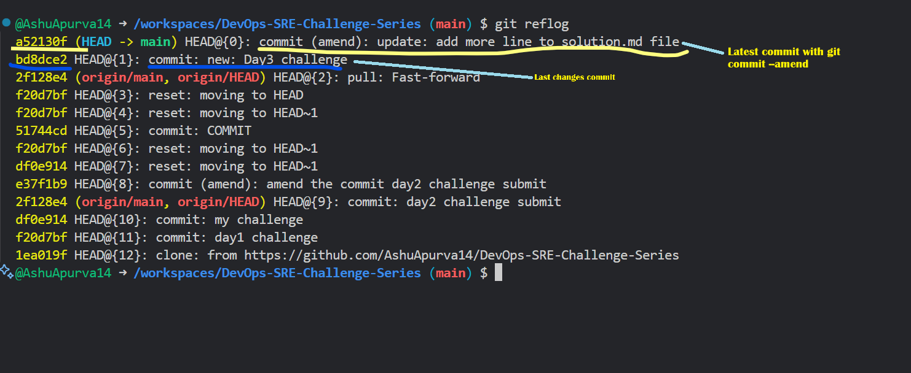
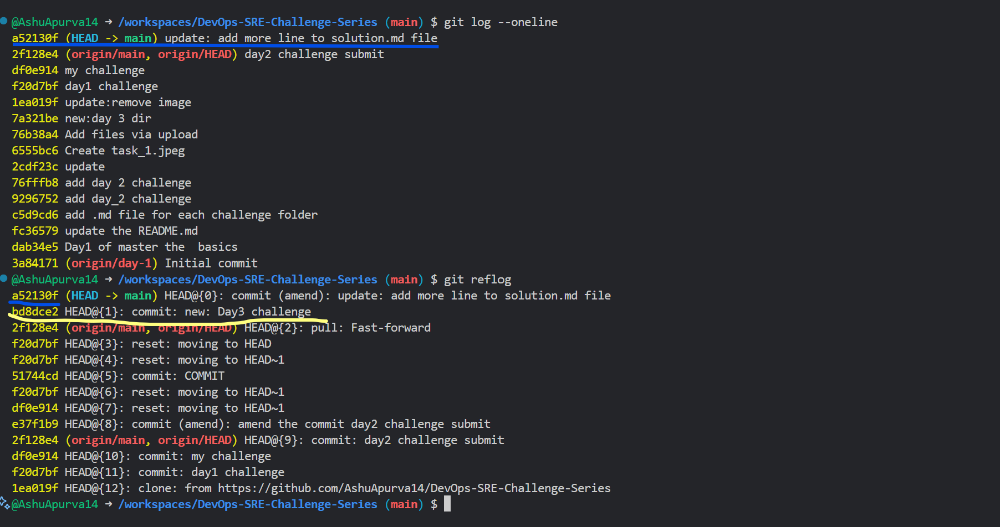
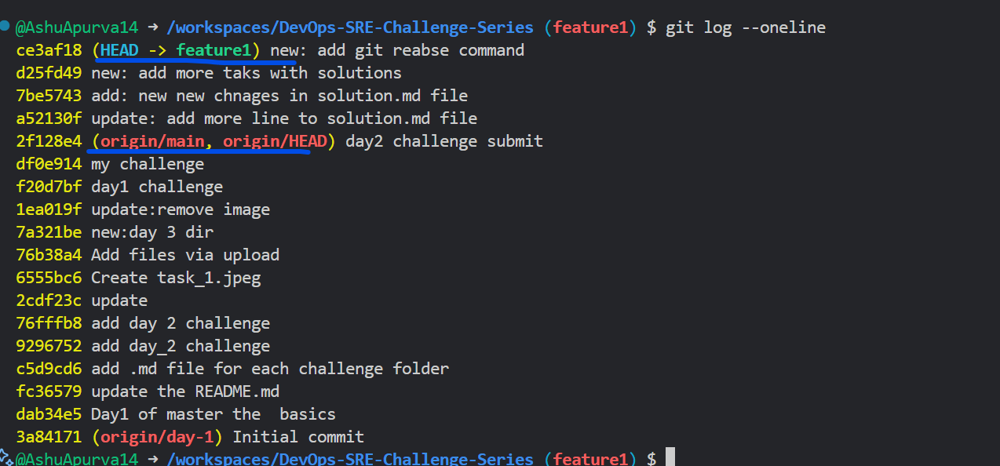
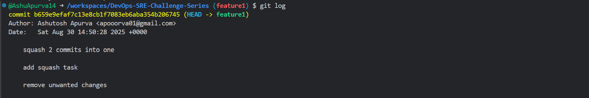
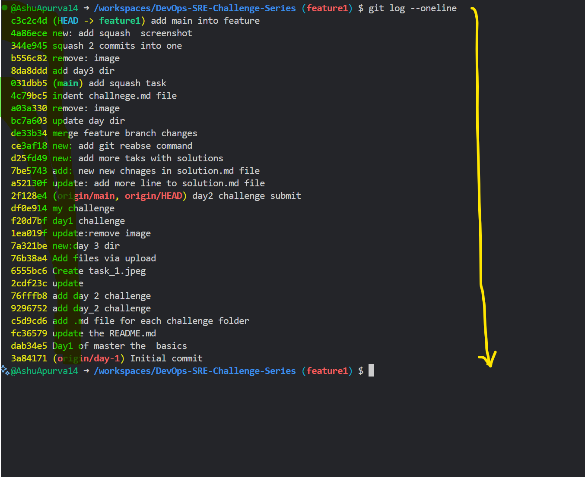

# Challenge Solution

## Task 1: Amend a Commit

The `git commit --amend` command is the convenient way to modify the recent changes.It lets you combine the staged chnages with previous commit instead of cretaing a entierly new commit.

```
git commit --amend

```

*Example:*

**Let's supoose you have couple of files in your repo and made some chnages on those files.Then, you have staged and commit the changes in local(you have not pushed the changes to remote repository).**

```
git add /Day_3/challenge_solution.md challenge3.md

git commit -m "feat: add new lines in these files"

```

**Now, you missed to add a change to file in the last commit. So, you want to add the change and commit it.After done with change in the file, follow below steps:**

```
git add /Day_3/challenge_solution.md

git commit --amend -m "update: add few more changes to solution file"
```

So, this is how you can utilise the `git commit ---amend` command to fix **typos in the commit message** and **Add missed changes.**

### Verify with

`git log --oneline`

---



---



---


## Task 2: Interactive Rebase

**Squash Commits:** Combining multiple individual commits into single. consolidated comit.

 - **When to Squash**

  1. Before merging a feature branch to simplify code review.

  2. To roll up many small commits into one, making rollbacks and change tracking easier.

  3. To keep the project commit history organized and meaningful.


**Reword Commits:** Reword in git means changing the commit messages of  one or more previous commits without any changes to actual code.

 - **Why Reword Commits?**

  1. To correct typos, clarify descriptions, or add information missed in the original commit message.

  2. To maintain a clean, professional commit history before sharing work or merging branches.

 - *To reword older commit messages, use interactive rebase— `git rebase -i HEAD~N` (where N is the number of commits back)*


**Drop Comiits:**  Dropping commits in Git means removing specific commits from the project history so that it's as if they never happened.

 - **Cautions**

 1. Dropping commits irreversibly rewrites history. If others are working on the same branch, coordinate with them to avoid conflicts or lost work.

 2. For public repositories, consider using git revert instead, as this preserves history but undoes changes safely.


 - *The most common way to drop (delete) commits is through interactive rebase: run `git rebase -i HEAD~N`, where N is the number of commits back to review.*


 - Rebase the last 3 commits

 *Before rebasing, have your target branch up to date, work on the correct branch, consider backing up, have permission to force push if needed, keep your working directory clean, and be prepared to resolve conflicts.*

  1. Check the last 3 commits with `git log --oneline`.

  2. Be on the branch (Typically feature) where you will rebase the master/main branch.

  3. you can rebase the last 3 commits using `git rebase -i HEAD~3`, where 3 is the number of commits.
  
  


 - Squash last 2 commits and reword a message

  

   
 - Final history
  
  
---

## Task 3: Tag a Release

 **In the context of Git, tagging is a way to label specific points in your project's history, most commonly to mark release versions, major milestones, or significant events.**

 **Tagging in Git involves placing a “tag” on a particular commit (snapshot of your project), like sticking a bookmark or sticky note on a key page in a book. Once added, this tag will always point to the exact state of your repository at that moment, making it easy to revisit, share, or reference that version.**


 **Why Use Tags in Git?**
  
  *Release Management:*
  - Tags are essential for labeling releases, such as v1.0 or v2.3.1, so anyone can retrieve that exact version for bug fixes, deployment, or reference later.

  *Version Control:*
  - Tags help identify stable, feature-complete, or test versions of the software in the repository.

  *Collaboration:*
  - They provide an easy way for teams or automation tools to refer to specific code versions without confusion.

  **Two types of tags are available in [git](https://git-scm.com/book/en/v2/Git-Basics-Tagging):**
   1. *Lightweight tags*
   2. *Annotated tags*

---

 - Create an *annotated tag* v2.0.0.

   1. You can create an annotated tag using `git tag -a v2.0.0 -m "Official release of version 2.0".`
    
 - Push the tags to Github.

 


