# Challenge Solution

## Task 1: Amend a Commit

The `git commit --amend` command is the convenient way to modify the recent changes.It lets you combine the staged chnages with previous commit instead of cretaing a entierly new commit.

```
git commit --amend

```

*Example:*

**Let's supoose you have couple of files in your repo and made some chnages on those files.Then, you have staged and commit the changes in local(you have not pushed the changes to remote repository).**

```
git add /Day_3/challenge_solution.md challenge3.md

git commit -m "feat: add new lines in these files"

```

**Now, you missed to add a change to file in the last commit. So, you want to add the change and commit it.After done with change in the file, follow below steps:**

```
git add /Day_3/challenge_solution.md

git commit --amend -m "update: add few more changes to solution file"
```

So, this is how you can utilise the `git commit ---amend` command to fix **typos in the commit message** and **Add missed changes.**

### Verify with

`git log --oneline`

---


---


---


## Task 2: Interactive Rebase

**Squash Commits:** Combining multiple individual commits into single. consolidated comit.

 - **When to Squash**

  1. Before merging a feature branch to simplify code review.

  2. To roll up many small commits into one, making rollbacks and change tracking easier.

  3. To keep the project commit history organized and meaningful.


**Reword Commits:** Reword in git means changing the commit messages of  one or more previous commits without any changes to actual code.

 - **Why Reword Commits?**

  1. To correct typos, clarify descriptions, or add information missed in the original commit message.

  2. To maintain a clean, professional commit history before sharing work or merging branches.

 - *To reword older commit messages, use interactive rebase— `git rebase -i HEAD~N` (where N is the number of commits back)*


**Drop Comiits:**  Dropping commits in Git means removing specific commits from the project history so that it's as if they never happened.

 - **Cautions**

 1. Dropping commits irreversibly rewrites history. If others are working on the same branch, coordinate with them to avoid conflicts or lost work.

 2. For public repositories, consider using git revert instead, as this preserves history but undoes changes safely.


 - *The most common way to drop (delete) commits is through interactive rebase: run `git rebase -i HEAD~N`, where N is the number of commits back to review.*


 - Rebase the last 3 commits

 *Before rebasing, have your target branch up to date, work on the correct branch, consider backing up, have permission to force push if needed, keep your working directory clean, and be prepared to resolve conflicts.*

  1. Check the last 3 commits with `git log --oneline`.

  2. Be on the branch (Typically feature) where you will rebase the master/main branch.

  3. you can rebase the last 3 commits using `git rebase -i HEAD~3`, where 3 is the number of commits.
  
  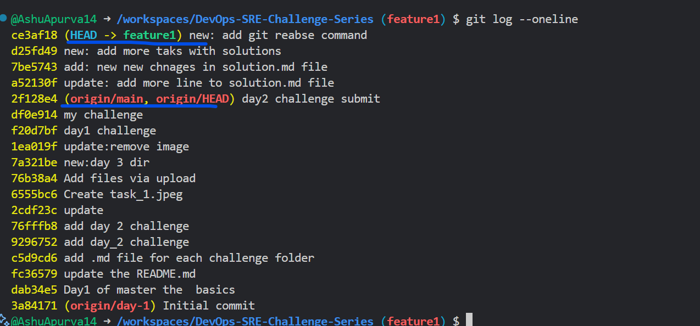


 - Squash last 2 commits and reword a message

  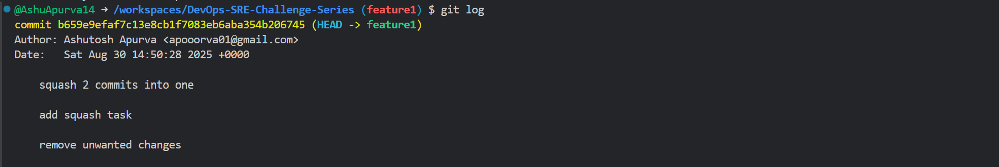

   
 - Final history
  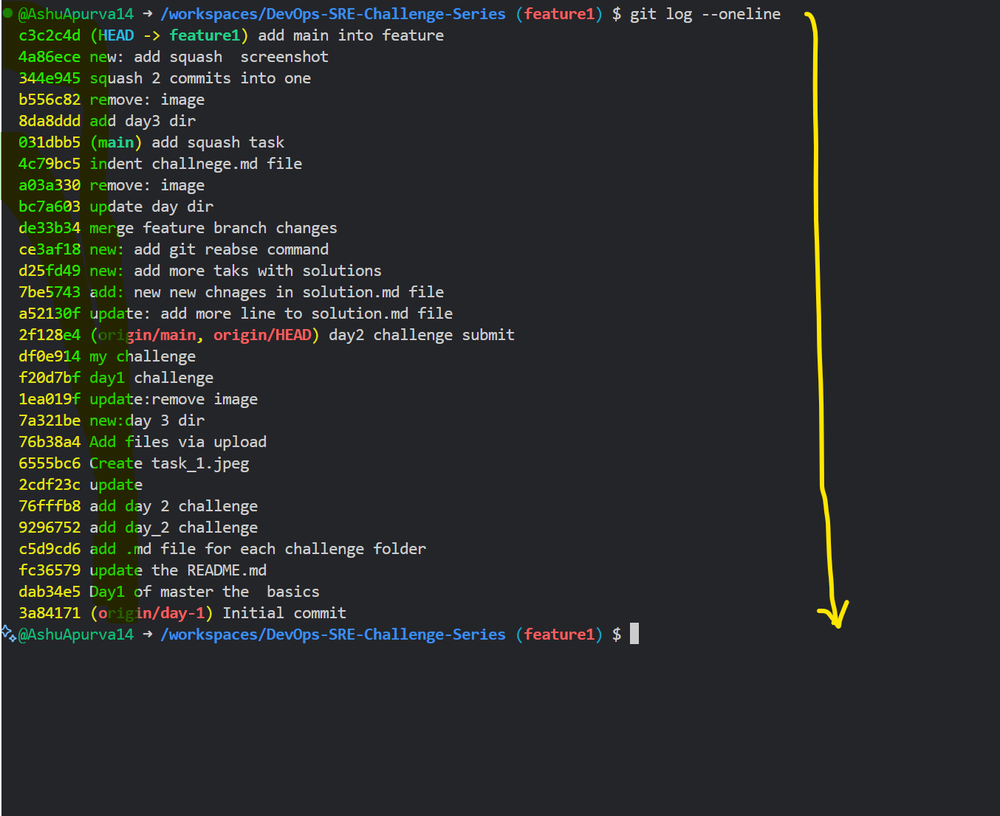
  
---

## Task 3: Tag a Release

 **In the context of Git, tagging is a way to label specific points in your project's history, most commonly to mark release versions, major milestones, or significant events.**

 **Tagging in Git involves placing a “tag” on a particular commit (snapshot of your project), like sticking a bookmark or sticky note on a key page in a book. Once added, this tag will always point to the exact state of your repository at that moment, making it easy to revisit, share, or reference that version.**


 **Why Use Tags in Git?**
  
  *Release Management:*
  - Tags are essential for labeling releases, such as v1.0 or v2.3.1, so anyone can retrieve that exact version for bug fixes, deployment, or reference later.

  *Version Control:*
  - Tags help identify stable, feature-complete, or test versions of the software in the repository.

  *Collaboration:*
  - They provide an easy way for teams or automation tools to refer to specific code versions without confusion.

  **Two types of tags are available in [git](https://git-scm.com/book/en/v2/Git-Basics-Tagging):**
   1. *Lightweight tags*
   2. *Annotated tags*

---

 - Create an *annotated tag* v2.0.0.

   1. You can create an annotated tag using `git tag -a v2.0.0 -m "Official release of version 2.0".`
    
 - Push the tags to Github.

---

## Task 4: Sync with Upstream

 - Fork a repo, add upstream, and sync changes.

   1. Fork a repo 

   2. Add upstream `git remote add upstream <repo url>`

     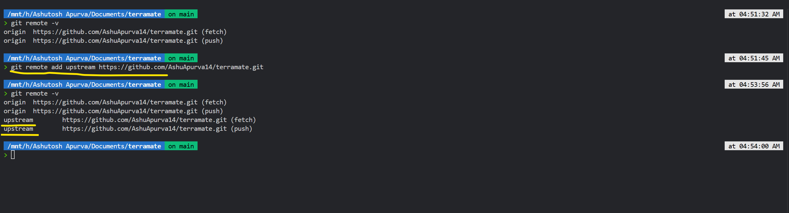     

   3. Sync fork repo `git fetch upstream`

     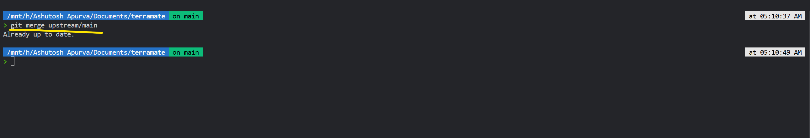

     


## Task 5: Stashing and Cherry-Picking

🔹 1. Git Stash

👉 Analogy:
Imagine you’re writing a document, but someone tells you, “Stop, switch tasks!”. Instead of throwing away your half-written page, you quickly put it in a drawer (stash) and come back later.

That’s what git stash does — it temporarily shelves (stashes) your uncommitted changes so you can work on something else, and then reapply them later.


✅ Example: Using Stash

- You’re on main branch, editing file1.py and file2.py.
 
`git status`

shows:

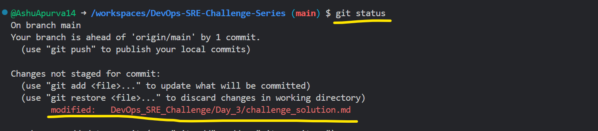

- Suddenly, you need to switch branches but don’t want to commit.

`git stash push`

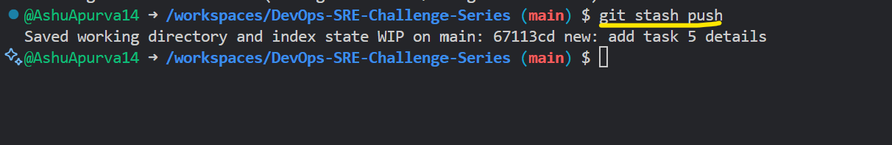


- This saves your modifications and cleans your working directory.

   - Now git status shows a clean tree.

   - Switch branches or pull updates safely.

   - When ready, bring back your changes:


`git stash pop`


- This reapplies your stashed changes and removes them from stash.

  👉 If you want to keep the stash for reuse:


`git stash apply`


📝 **Stash Commands Cheatsheet**

- `git stash` → save uncommitted changes

- `git stash list` → see all stashes

- `git stash apply stash@{1}` → apply a specific stash

- `git stash drop stash@{1}` → delete a stash

- `git stash clear` → remove all stashes


---

🔹 2. Git Cherry-Pick

👉 *Analogy:*

 Imagine you baked a cake with 5 layers (commits), but your friend only wants the 3rd layer. Instead of giving the whole cake, you pick that specific layer and place it into another cake.

That’s what git cherry-pick does — it copies a specific commit from one branch and applies it to another branch.

✅ Example: Cherry-Pick

 - On feature-branch, you make 3 commits:

     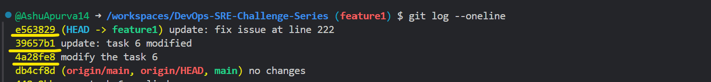   

 - Your teammate says: “I need just the bug fix (g7h8i9) in main right now!”

 - Switch to main:

    `git checkout main`


 - Cherry-pick the commit:

    `git cherry-pick `


 - Now main has that commit, without merging the other ones.

   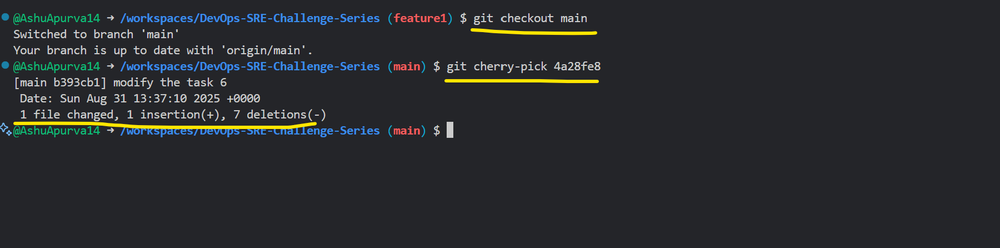

📝 **Cherry-Pick Cheatsheet**

`git cherry-pick <commit-hash>` → pick one commit

`git cherry-pick A..B` → pick a range of commits (exclusive of A, inclusive of B)

`git cherry-pick --abort` → cancel if conflicts occur

`git cherry-pick --continue` → continue after fixing conflicts

---

## Task 6: Rebase a Feature Branch


  - Rebase onto main, resolve conflicts, and push.

   1. Chekcout into feature branch and run `git rebase main`

  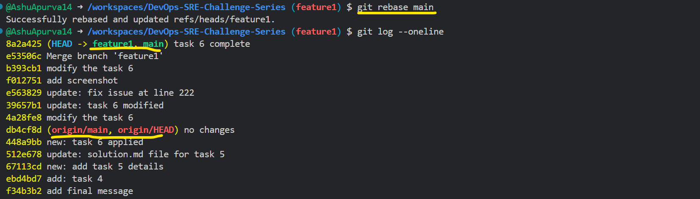
----
  
## Task 7: Undo with Revert
   
  - Revert a commit and verify the new undo commit.

   🔹 What does git revert do?

  **Analogy:**
    
     If you wrote something in your notebook and realize it’s wrong, instead of tearing the page out (which rewrites history), you write a new line that says “undo previous mistake”.

    So git revert doesn’t delete the old commit — it creates a new commit that undoes its changes.

  🔹 Example: Undo with Revert
   
  1. Check commit history

    `git log --oneline`


   **Output:**

    


     Here, let’s say we want to undo commit d4e5f6 (Add debug logs).

  2. Revert the commit

   `git revert d4e5f6`


   - This will create a new commit that undoes the changes from d4e5f6.

   - Your editor will open with a default message:

   - Revert "Add debug logs"
 
   - Save & close.


  3. Verify new “undo” commit

   - Check the log again:

    `git log --oneline`


  Now you’ll see:

```
z9y8x7 Revert "Add debug logs"
a1b2c3 Fix login bug
d4e5f6 Add debug logs
g7h8i9 Add login API

```


👉 Notice: d4e5f6 is still there, but z9y8x7 undoes it.

4. Confirm file changes

  - If you check the files:

    `git show z9y8x7`


  - You’ll see the inverse of what d4e5f6 did.


🔹 When to use Revert vs Reset

  - `Revert` → safe for shared branches (main/master), history stays intact.

  - `Reset` → rewrites history, so safer for local branches only.

✅ Summary of Task 7

  - Run `git revert <commit-hash>`

  - Confirm the new commit message “Revert …”

  - Check git log → see the new undo commit.


---

## Task 8 – Branching Strategies (gitflow, Git Hub Flow, Trunk-based)

### Branching Strategies: Gitflow, GitHub Flow, and Trunk‑Based Development

This guide covers the three popular branching models, when to use each, trade‑offs, and simple visuals (Mermaid) to show relationships and workflow.

---

## Gitflow

**When it shines:** Larger products with scheduled releases, parallel work on upcoming versions, and need for structured hotfixes.

**Core branches**

* `master` (a.k.a. `main`): always production‑ready
* `develop`: integration branch for next release
* Supporting branches: `feature/*`, `release/*`, `hotfix/*`

**Pros**

* Clear separation of work in progress vs. release‑ready
* Dedicated `release` branches for stabilization
* Formal hotfix path to production

**Cons**

* Heavier ceremony; more merges
* Slower feedback loops; not ideal for true continuous deployment

**Typical flow**

1. Branch `feature/*` from `develop` → implement → merge back to `develop`.
2. Cut `release/*` from `develop` → stabilize → merge to both `master` and `develop`.
3. Tag releases on `master` (e.g., `v1.3.0`).
4. `hotfix/*` from `master` for urgent fixes → merge back to both `master` and `develop`.

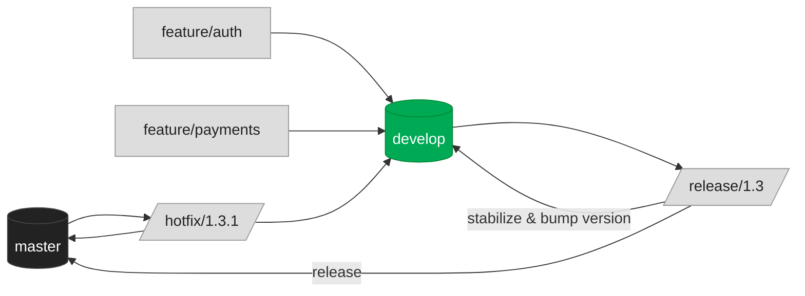

**Commands snapshot**

```bash
# start a feature
git checkout -b feature/foo develop
# finish feature
git checkout develop && git merge --no-ff feature/foo && git branch -d feature/foo
# create a release
git checkout -b release/1.3 develop
# finish a release
git checkout master && git merge --no-ff release/1.3 && git tag v1.3.0
git checkout develop && git merge --no-ff release/1.3 && git branch -d release/1.3
# hotfix
git checkout -b hotfix/1.3.1 master
```

---

### GitHub Flow

**When it shines:** Small/medium web apps with frequent deploys, simple workflow, cloud CI/CD.

**Core idea**

* Single long‑lived branch: `main` is always deployable
* Short‑lived `feature/*` branches + Pull Requests
* Continuous integration on every PR; deploy from `main`

**Pros**

* Minimal ceremony; fast
* Perfect for continuous delivery/deployment
* Fewer long‑lived branches to manage

**Cons**

* No dedicated release branch; stabilization must happen within PRs
* Backporting fixes to old versions is trickier

**Typical flow**

1. Branch from `main` → push commits → open PR.
2. CI runs tests/lint; code review.
3. Merge (often squash‑merge) to `main` → auto‑deploy.

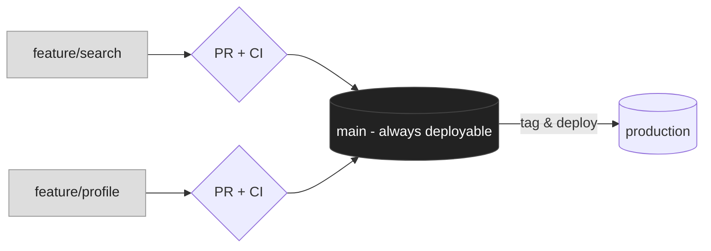

**Commands snapshot**

```bash
# start a change
git checkout -b feature/search main
# push & open PR on GitHub
git push -u origin feature/search
# after review, squash-merge via GitHub UI (or CLI) into main
# deploy pipeline triggers from main
```

---

### Trunk‑Based Development (TBD)

**When it shines:** High‑velocity teams, continuous integration, continuous deployment with **feature flags**.

**Core idea**

* One trunk branch (`main`/`trunk`)
* **Very short‑lived** branches (hours/day), rebased frequently
* Feature flags toggle incomplete work in production
* Release via tags (and optionally ephemeral release branches)

**Pros**

* Fast feedback and simplest history
* Encourages tiny PRs and continuous integration
* Works best with CD + feature flags/dark launches

**Cons**

* Requires strong CI discipline and test coverage
* Without feature flags, incomplete work can leak

**Typical flow**

1. Branch from `main` → small change → rebase/merge back quickly.
2. Wrap incomplete features behind flags.
3. Tag releases and (optionally) create short‑lived `release/*` branches for hardening.

```mermaid
flowchart LR
  classDef trunk fill:#0a5,color:#fff,stroke:#083;
  classDef short fill:#ddd,color:#222,stroke:#999;
  classDef note fill:#eef,color:#222,stroke:#99f,stroke-dasharray: 3 3;

  T[(main/trunk)]:::trunk
  B1[branch A (hours/day)]:::short --> T
  B2[branch B (hours/day)]:::short --> T
  B3[branch C (hours/day)]:::short --> T

  T --> TAG1((tag v1.2.0))
  T --> REL[/optional release/1.2/]:::short --> TAG2((tag v1.2.1))

  FF[Feature flags & CI]:::note -. guard & test .-> T
```


**Commands snapshot**

```bash
# tiny branch
git checkout -b chore/refactor-x main
# keep up to date, rebase if needed
git fetch origin && git rebase origin/main
# open small PR, merge quickly (hours/day)
# releases via tags
git tag v1.2.0 && git push origin v1.2.0
```

---

### Recommendations by Scenario

#### 1) Small team, web app, **continuous deployment**

**Choose: Trunk‑Based Development (with feature flags).**

* **Why:** Minimal overhead, fastest integration, and best fit for CD. Tiny PRs keep the main branch green and releasable at all times. Feature flags allow merging early/often without exposing incomplete work.
* **How to run it:**

  * Protect `main`: require PR + status checks (tests, lint, security scan).
  * Enforce small PRs (< \~300 lines), branch life < 1 day.
  * Add a feature‑flag framework (e.g., config toggles, remote flags).
  * Auto‑deploy on merge to `main`; tag each production deploy.

#### 2) Large team, enterprise product, **monthly releases**

**Choose: Gitflow.**

* **Why:** Release branches support prolonged stabilization and parallel feature development for the next version. Clear hotfix path to production while keeping `develop` moving. Easier coordination across many squads and external stakeholders.
* **How to run it:**

  * Long‑lived `develop` and `master`; use `release/*` for hardening near month‑end.
  * Enforce PRs into `develop`; limit risky changes after cutting a `release/*`.
  * Tag on `master` for each monthly GA (e.g., `v2025.09`).
  * Use `hotfix/*` from `master` for urgent production issues; merge back to both `master` and `develop`.

---

### Quick Decision Guide

* Need **CD** and speed, few teams → **Trunk‑Based** (with flags)
* Simple cloud app, frequent deploys, small team → **GitHub Flow** works well too
* Multiple teams, formal releases, backports/hotfixes → **Gitflow**

---
