# Solution --> Day 4 

## 1. Set Up a GitHub Organization and Manage Access

    
   - Created a Github Organization named "DevOps-Challenge-orgs."
   - Go to GitHub account Settings > Organization > New Organization.
   
     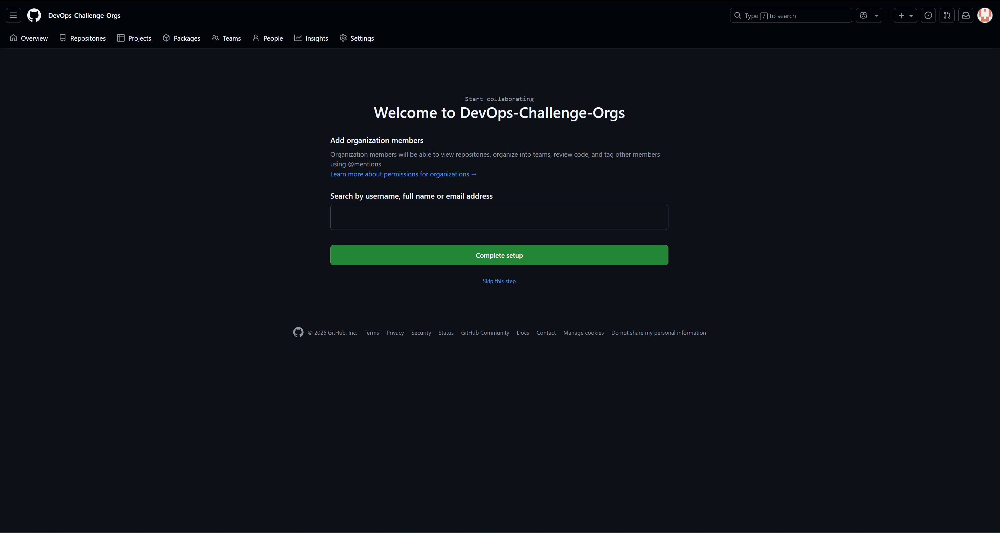

     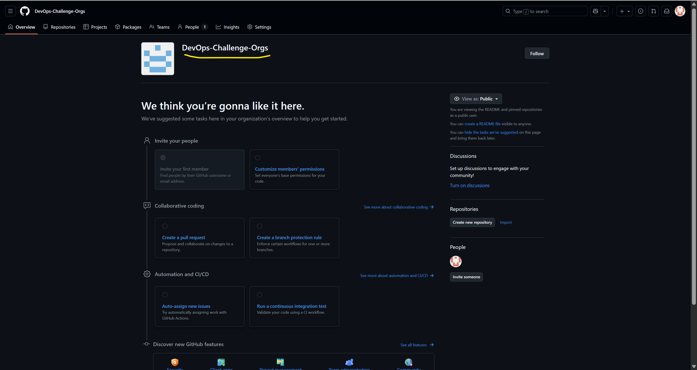


 ### Invite Users:
    
   - I invited 4 users in the newly created organization.


### Create Teams:

   - **Create 3 teams:**

      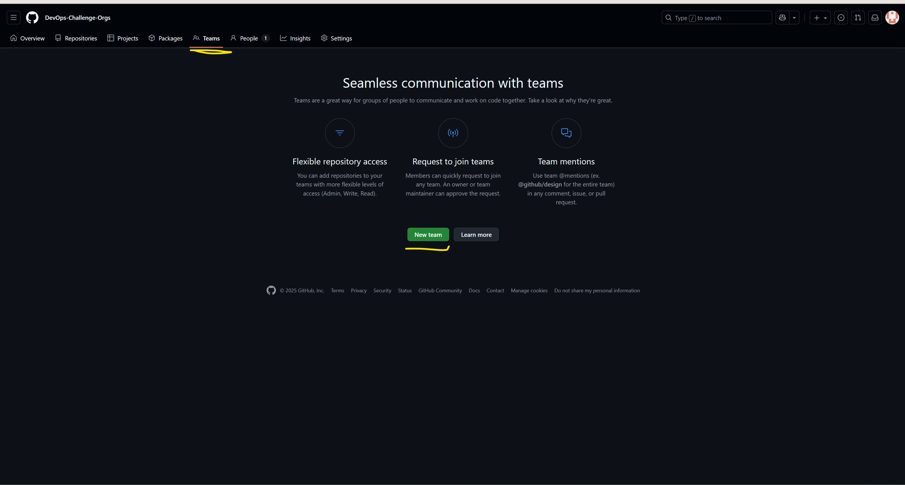

    

      - Developers: For developers who will write code.
      - DevOps: For DevOps engineers who will manage infrastructure.
      - QA: For testers who will review and test code.
        


      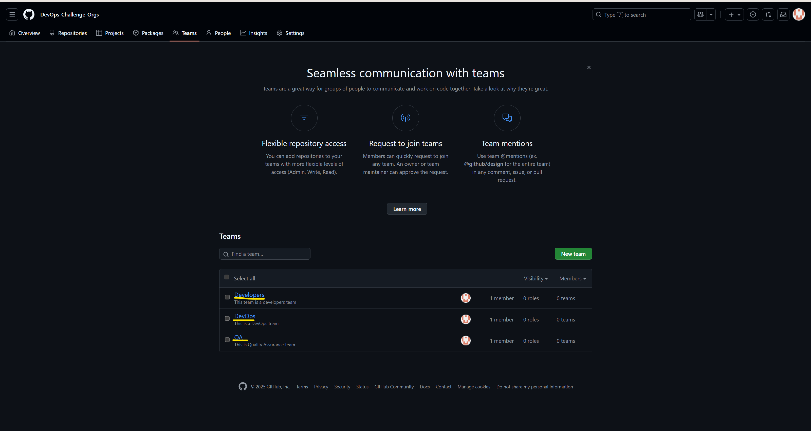

### Assigned Repository Permissions:

- **Created a new repository called sample-project. Assign permissions:**

   ```
   Developers: Write access.
   DevOps: Admin access.
   QA: Read access.

   ```

   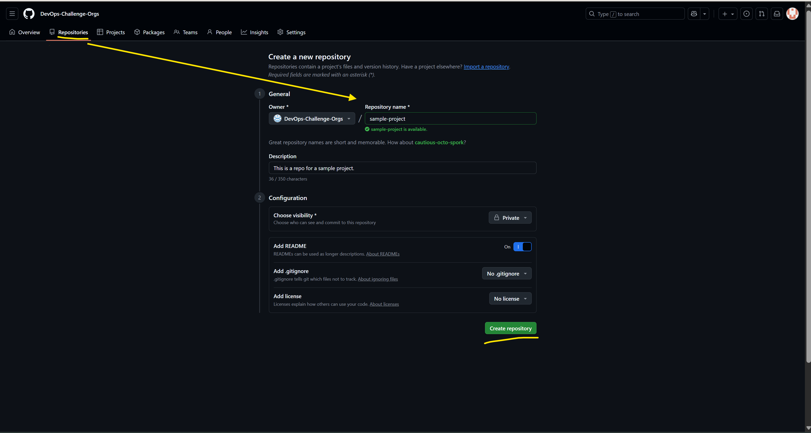

   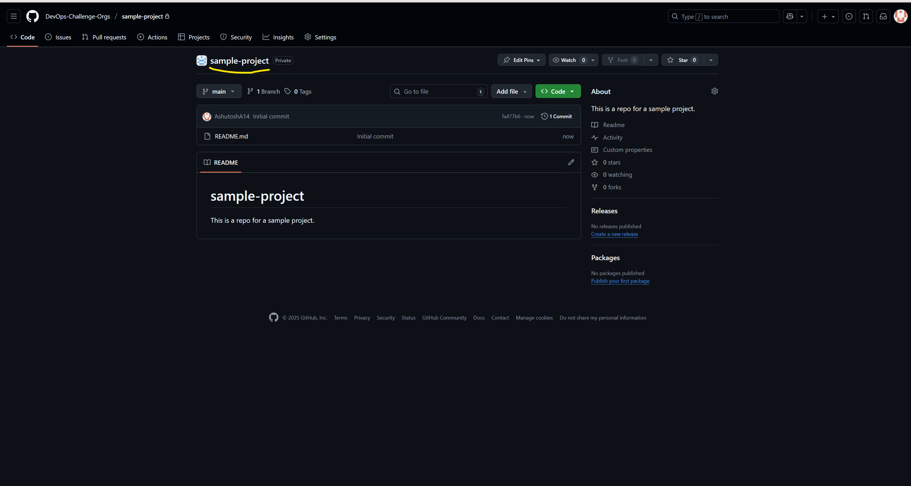


### Enabled Two-Factor Authentication (2FA):

   - **Enforced 2FA for all organization members.**
   - **Go to organizations > DevOps-Challenge-Orgs > settings/security**

     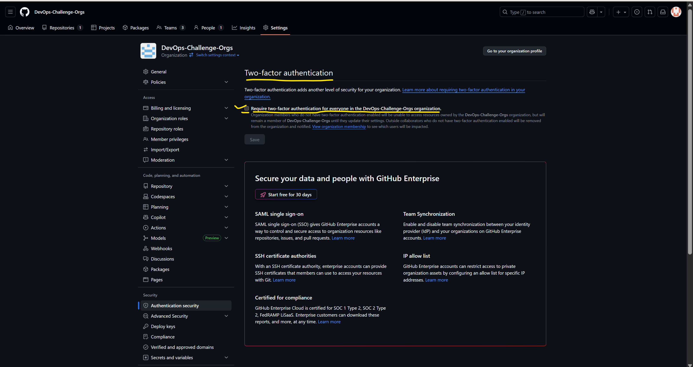
    

## 2. Enabled Security Features for Repositories
   
   - **Go to Seetings > Security > Advance security**
   - **Enabled Depandabot alerts, Secrets scanning**

     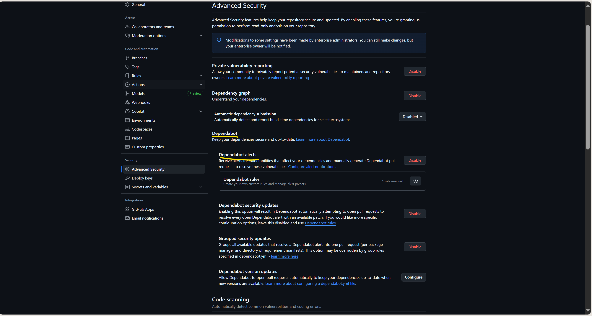


  - **Set up branch protection rules**
  - **Go to Settings → Branches → Added branch protection rule.**
  - **set  the following rules:**
    - Require a pull request before merging.
    - Require approvals (set to 2).
    - Require status checks to pass before merging.
    - Include administrators.

    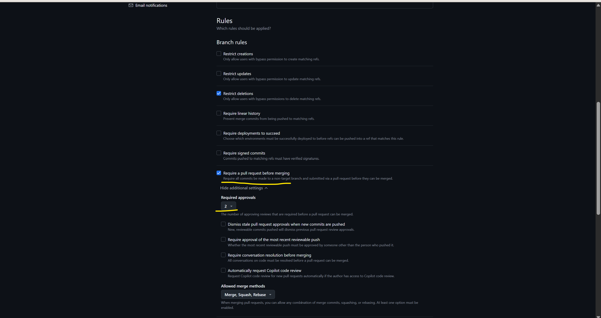
    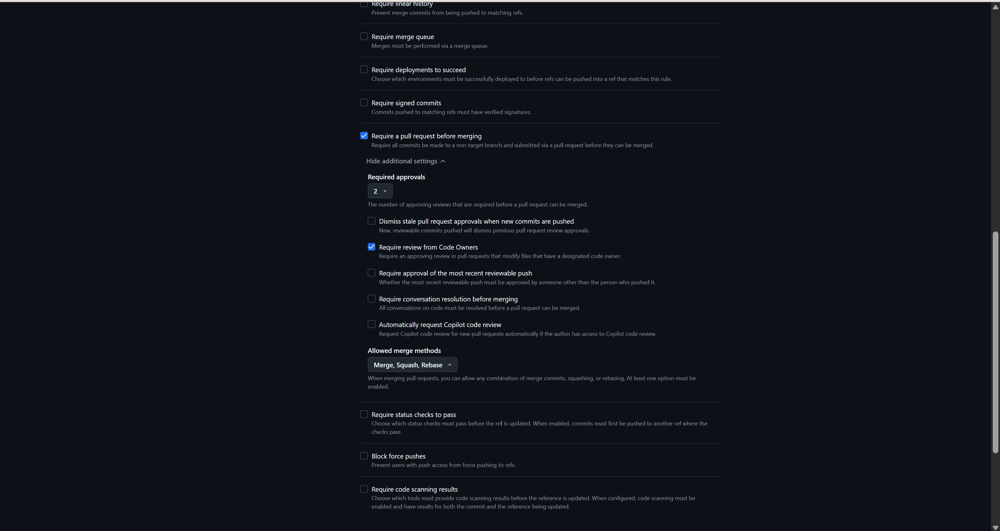
    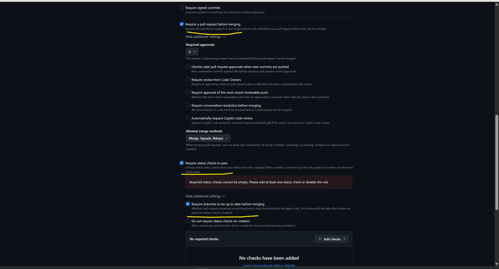


## 3. Implemented PR Validation and Code Owner Reviews

**Created a CODEOWNERS file:**
  
  - **In the sample project repo, create a file at .github > CODEOWNERS.**
  - **Added the following rules:**

    ```
    Code owners for specific files/directories
    *.js @DevOps-Challenge-Org/Developers @DevOps-Challenge-Org/DevOps
    /infrastructure/ @DevOps-Challenge-Org/DevOps @DevOps-Challenge-Org/QA
    ```

    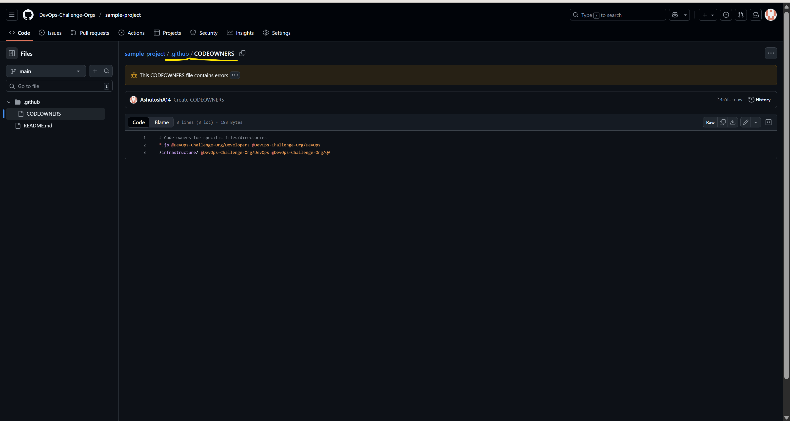


**Require Code Owner Reviews:**   
  
  - Go to Settings → Branches → Edit branch protection rule for main.
  - Enabled Require review from Code Owners.

    


  - Tested the Workflow:

    - Created a new branch, make changes to a .js file, and open a PR.

      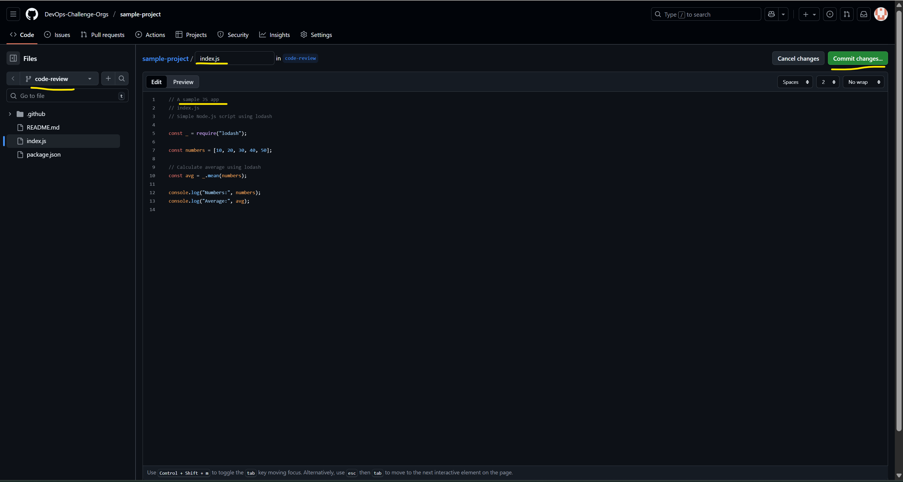

      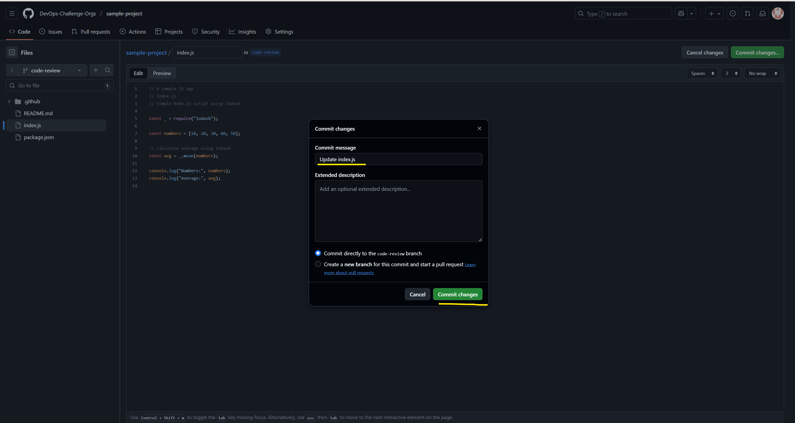

    - Ensured the PR cannot be merged without approval from 2 code owners.Here you can see open pull request merge only works once approved by 2 approver.

      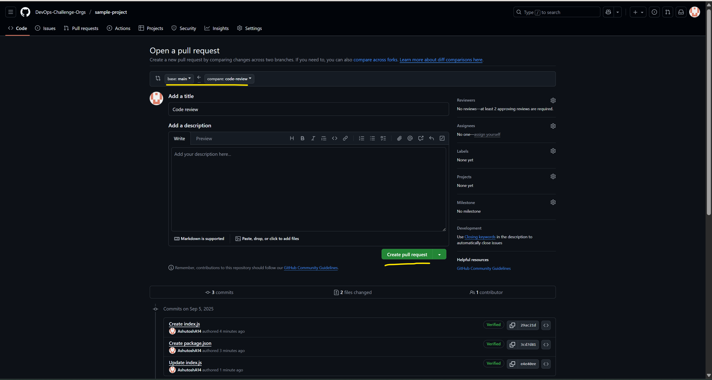

      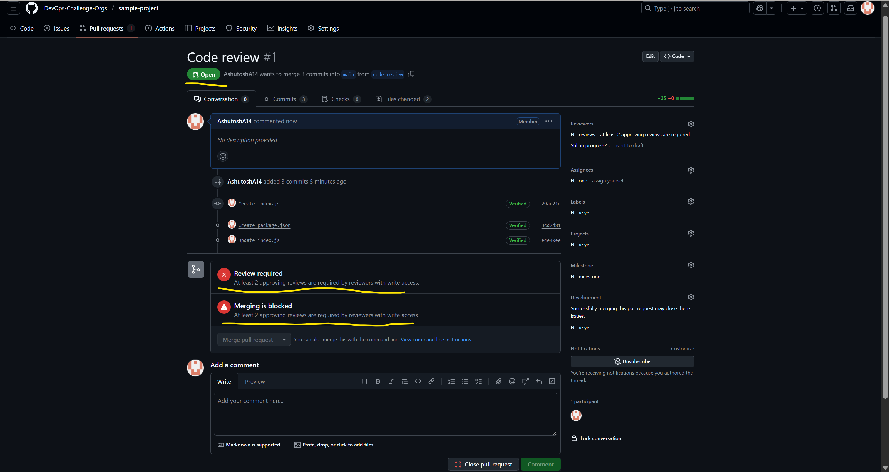


## 4. Restricted Direct Commits to the main Branch

 - **Enabled Branch Protection Rules:**

     - Go to the sample-project repository → Settings → Branches → Add branch protection rule.

     - Selected the main branch.


- **Enabled the following options:**

     - Required a pull request before merging. Require approvals (set to 2).

      

     - Required status checks to pass before merging. Include administrators.

      


- **Tested the Restriction:**
    
     - pushed directly to the main branch.The result showed it is blocked as per the rules

     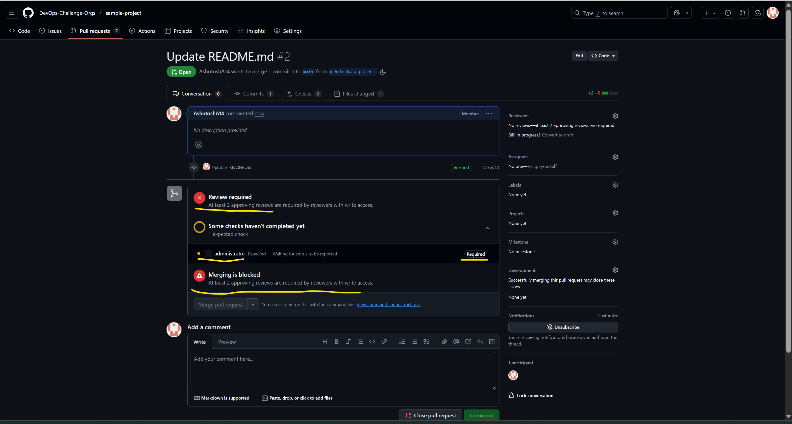


## 5. Enforced Proper Commit Messages in PRs   

   **Step 1: Define a commit message policy**

    
   **Type**

A single word indicating the kind of change:
- **feat**: A new feature  
- **fix**: A bug fix  
- **docs**: Documentation-only changes  
- **style**: Formatting, whitespace, semicolons, etc. (no code changes)  
- **refactor**: A code change that is neither a feature nor a bug fix  
- **test**: Adding missing tests or correcting existing ones  
- **chore**: Changes to the build process or auxiliary tools/libraries  
- **ci**: Changes to the CI/CD configuration files  

  **Scope** (optional)

The part of the codebase affected by the change, enclosed in parentheses.  
Examples: `feat(login)`, `fix(api)`, `refactor(database)`

  **Description**

- A short, imperative, present-tense summary of the change  
- Use the **imperative mood**: e.g., "add", not "added" or "adds"  
- The first letter should **not be capitalized**  
- Do **not** end with a period  
- Keep the entire first line under **50 characters** for readability  

---

 **✅ Example Messages**


  **Valid**

-  feat(authentication): add user login via email and password
- fix(checkout): resolve incorrect tax calculation
- docs(api): update outdated endpoint documentation
-  chore(deps): update dependency react-router to v6.12.0

**Invalid**

- added new stuff ❌ (missing type, not imperative)
- Fixing the user login bug ❌ (capitalized, wrong tense)
- feat: added a whole lot of changes ❌ (too long, mixes multiple changes)

**Step 2: Share the Commit Message Policy with Your Team**

    For the policy to be effective, all team members must be aware of it:

  - **Update the CONTRIBUTING.md file**: Add this section there (standard place for contribution rules).  
- **Create a dedicated wiki page**: For more detailed docs with examples.  
- **Announce it**: Share in team channels (Slack, Teams, etc.) and during meetings.  
- **Lead by example**: Maintainers and senior developers should consistently follow the policy.  

---

  **Step 3: Manually Review Commit Messages During Pull Requests**

Manual review is the most direct way to enforce the policy.

1. Open the pull request and go to the **"Commits" tab**  
2. Review each commit message and ensure it follows the defined format (`type(scope): description`)  
3. Check for **atomic commits** – each commit should represent one focused change  
4. Leave feedback if a commit is non-compliant (suggest correct format if possible)  

---

## 6. Required Approval from 2 Code Owners

  - Updated the CODEOWNERS File:
  - Ensured the .github/CODEOWNERS file defines code owners for all relevant files/directories. 
    - **Example:**

    ```
    Code owners for specific files/directories
    *.js @DevOps-Challenge-Org/Developers @DevOps-Challenge-Org/DevOps
    /infrastructure/ @DevOps-Challenge-Org/DevOps @DevOps-Challenge-Org/QA

    ```
   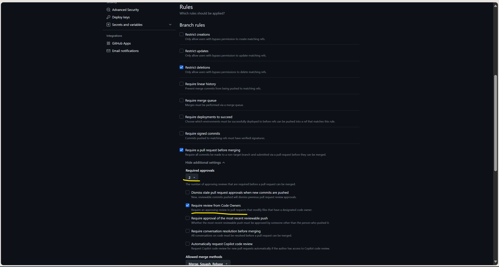


  - **Test the Workflow:** Created a PR and ensure it cannot be merged without approval from 2 code owners.


   


## 7. Ensured All Security Checks Pass Before Merging


  **Enabled Required Status Checks:**
   
  - Go to Settings → Branches → Edit branch protection rule for main.
  - Under Require status checks to pass before merging, enable: Dependabot alerts & Secret scanning.

  **Tested the Workflow:**

  -  Create a PR and ensure it cannot be merged if any security checks fail.


## 8. Used Coderabbit for AI-Powered Code Reviews


  **Signed Up for Coderabbit:**

   - Go to Coderabbit and sign up using your GitHub account.
   - Installed Coderabbit in Your Repository:
   - Followed the instructions on the Coderabbit GitHub page to install the     Coderabbit app in your sample-project repository.
   - Granted the necessary permissions for Coderabbit to access your repository.

   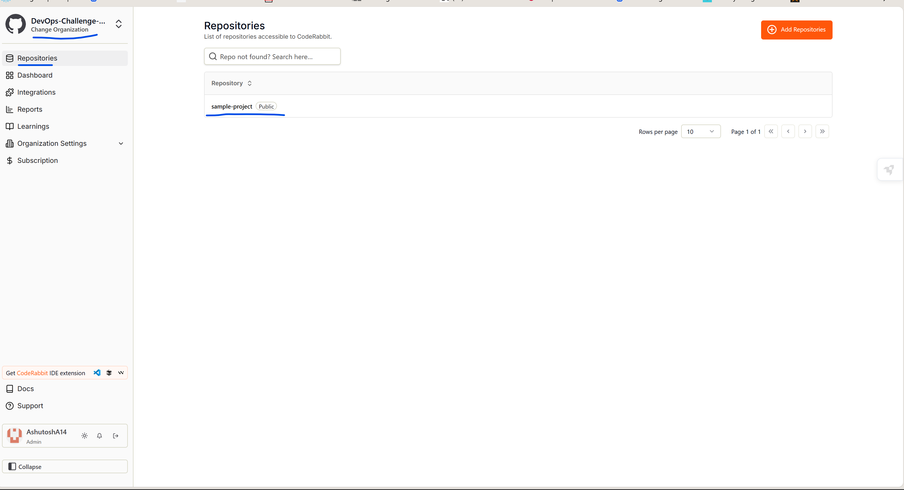

   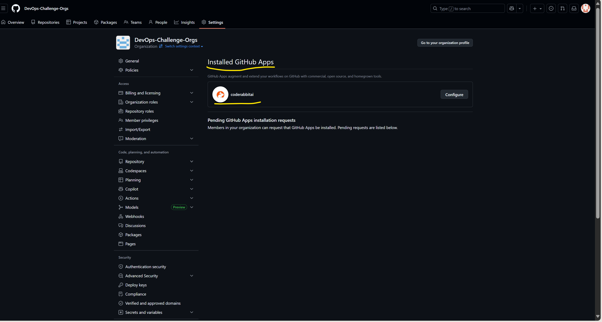

  **Configured Coderabbit:**

   - Created a .coderabbit.yaml file in your repository to customize Coderabbit’s behavior (optional). Example configuration:

   ```
   review:
   enabled: true
   rules:
     - type: code-quality
       severity: warning

   ```


**Tested Coderabbit:**

  - Created a new PR with some code changes.
  - Coderabbit will automatically review the PR and provide feedback in the comments.

  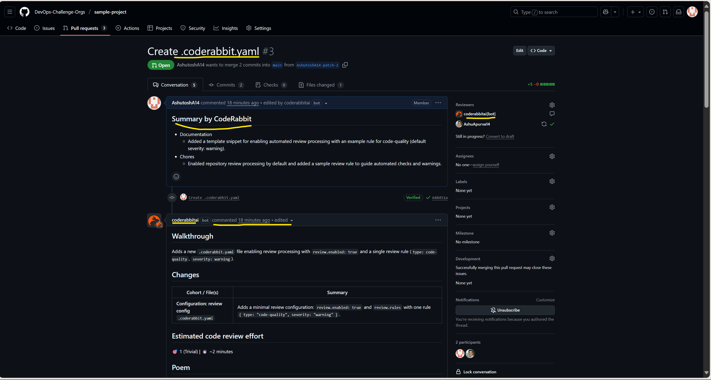


**9. Used a Bot for Additional Code Reviews**

   **Set Up a Bot Account:**

   - Created a new GitHub account for the bot (e.g., code-review-bot).
   - Generated a Personal Access Token (PAT) for the bot with repo permissions.

   **Installed a Code Review Tool:**

   - Used a third-party tool like Dependabot or CodeClimate.
   - For Dependabot: Go to Settings → Security & analysis

    I have already setup Dependabot and Depenadabot alerts in the previous steps.

   


   
  **Tested the Bot:**

  -  Created a PR and ensure the bot comments or approves/rejects based on the rules.


**10. Used GitHub Secrets for Sensitive Information**

  **Stord Secrets in GitHub:**

   - Go to the sample-project repository → Settings → Secrets and variables → Actions → New repository secret.
   - Added secrets like DATABASE_PASSWORD, API_KEY, etc.
   
     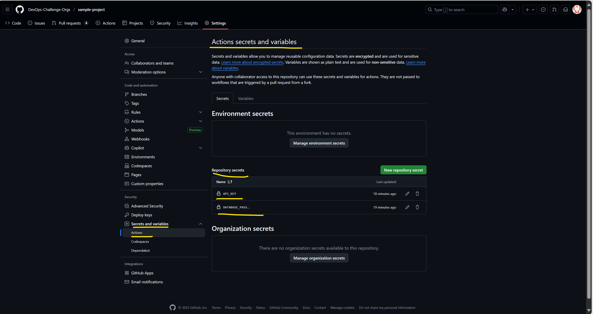

   - Used Secrets in Your Code: Create a sample script (e.g., deploy.sh) that uses the secrets. Example:
   
   ```
    #!/bin/bash
    echo "Deploying with API Key: $API_KEY"
    echo "Database Password: $DATABASE_PASSWORD"

   ```

   - **Tested the Workflow:**

     - Run the script in a local environment by setting the secrets as environment variables. Ensure the script can access the secrets securely.

     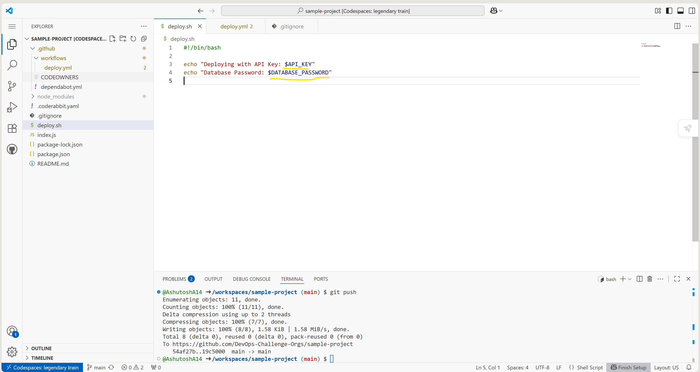


**11. Integrated Snyk for Vulnerability Scanning**

   **Signed Up for Snyk:**


   - Go to Snyk and sign up using your GitHub account.
   - Installed Snyk in Your Repository:

   - Followed the instructions on the Snyk website to connect your GitHub repository.
   - Granted the necessary permissions for Snyk to access your repository.

     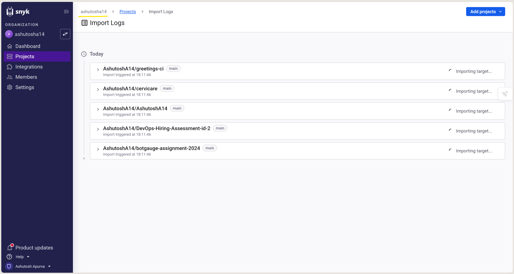

  **Configured Snyk:** 

   - Create a .snyk file in your repository to customize Snyk’s behavior (optional).

  - I have used below sample configuration for enabling .snyk scanning.

  ```
  # .snyk file
  version: v1.13.5
  ignore:
    'SNYK-JS-LODASH-567746':
    - '*':
        reason: 'No immediate fix available'
        expires: '2023-12-31T00:00:00.000Z'

  ```

     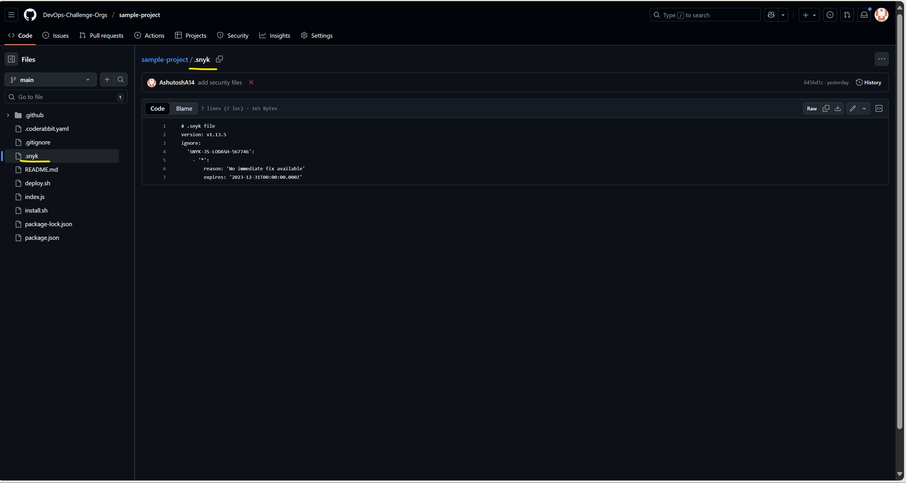


  -  Executed Snyk Scans: Use the Snyk CLI to run vulnerability scans on your dependencies.


  **Integrated Snyk with GitHub:*8


  - Go to your repository → Settings → Security & analysis → Snyk.

  - Enabled Snyk vulnerability scanning.


  -  Tested the Workflow: Create a PR and ensure Snyk scans the dependencies. Check the PR for Snyk’s vulnerability report


   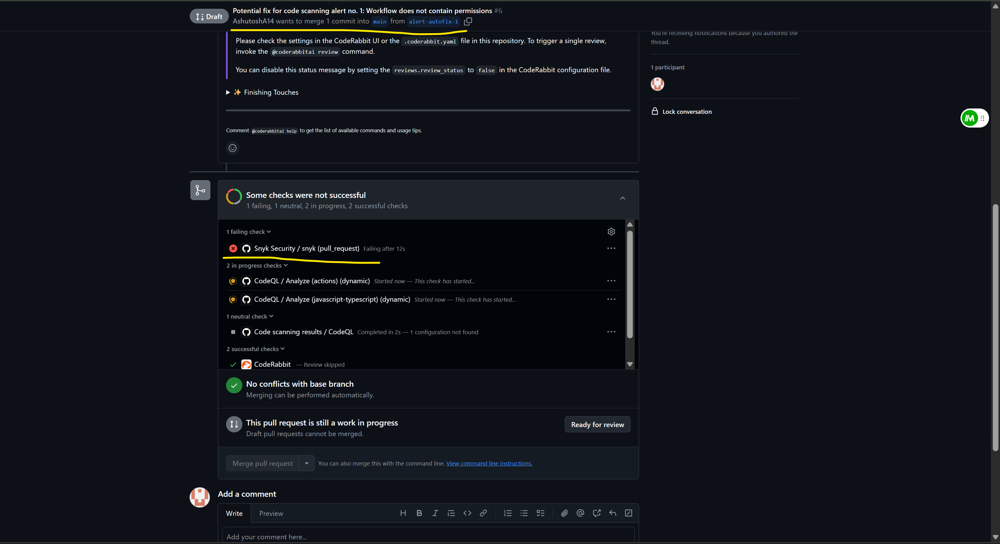


## 12. Audited User Activity

  - Checked the Audit Log: Go to the organization → Settings → Audit log.


  - Reviewed the logs to see actions performed by users (e.g., repository access changes, team modifications).
   

   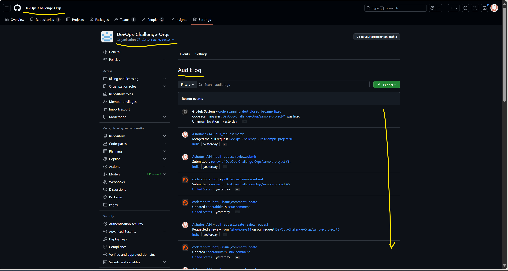

   


   


  


   


      


  


     
    
   

   


  